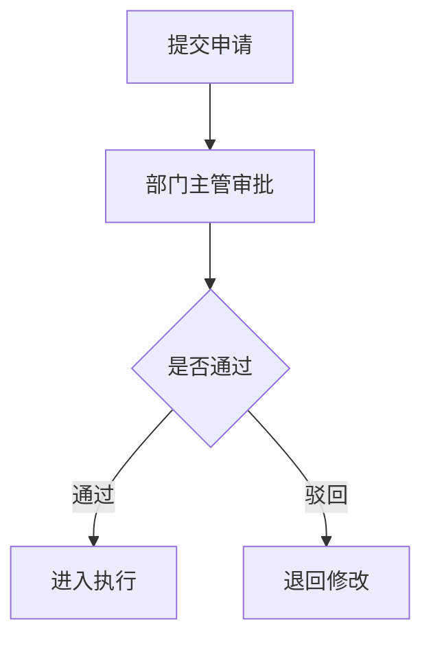

# dimens-manager 项目初始化章节 TipTap 文档样式与上传约束

## 1. 这份文档解决什么问题

这份文档专门给在线文档 Skill 使用，解决三件事：

1. TipTap 文档内容应该怎么写，才不像一坨纯文本
2. 文档里的颜色、状态、类型怎么控制
3. 文件、图片、附件、Mermaid 流程图在当前产品和 CLI 里分别是什么能力边界

## 2. 当前真实能力边界

当前仓库已经确认的事实：

- `dimens-cli` 已有文档主链：
  - `doc create`
  - `doc info`
  - `doc update`
  - `doc delete`
  - `doc versions`
  - `doc version`
  - `doc restore`
- `dimens-cli` 已有上传命令：
  - `upload file`
  - `upload mode`
- 产品接口层已有上传入口：
  - `POST /app/base/comm/upload`
- 服务端文档清洗逻辑允许保留富文本相关属性：
  - `class`
  - `style`
  - `id`
  - `data-video`
  - `data-attachment`
  - `data-file-name`
  - `data-file-size`
- 富文本编辑器已支持 Mermaid 数据，可在文档内容中写入 Mermaid 流程图、时序图、状态图等业务图表

所以结论要分清：

- “文档富文本编辑”是当前 CLI 已经覆盖的能力
- “文件/图片上传”是当前 CLI 和产品接口都已覆盖的能力
- “上传后直接并入文档”也已有 CLI 主链：`doc attach-file`、`doc append-image`
- “Mermaid 业务流程图”是当前富文本文档能力的一部分，可通过 `doc create --content` 或 `doc update --content` 写入

## 3. TipTap 文档的默认结构建议

如果 Skill 要帮用户生成项目说明、制度、操作手册、知识页，默认建议至少按下面结构组织：

1. 主标题
2. 简介段落
3. 彩色摘要卡片 / 状态区 / 提示区
4. 小节标题
5. 列表或步骤
6. 附件 / 图片 / 相关链接
7. 业务流程图 / 数据流图 / 审批流图（Mermaid）

不要直接输出一大段没有层次的正文，也不要生成只有黑白文字的单调文档。

## 4. 颜色与状态要怎么控

文档里如果有“状态”“风险”“提示”“类型”等语义，必须显式带颜色语义。用户创建文档时，默认要生成更生动的富文本，而不是纯黑白文本。

推荐语义如下：

| 场景 | 推荐风格 |
| --- | --- |
| 普通说明 / 默认状态 | `slate` / 灰色系 |
| 处理中 / 进行中 | `blue` / 蓝色系 |
| 已完成 / 已发布 / 正常 | `emerald` 或 `green` |
| 警告 / 待确认 | `yellow` 或 `orange` |
| 驳回 / 风险 / 异常 | `rose` 或 `red` |
| 分类标签 / 辅助强调 | `purple` / `indigo` / `pink` |
| 背景卡片 / 信息摘要 | 淡色背景 + 深色文字，例如 `#eff6ff/#1d4ed8`、`#f5f3ff/#6d28d9` |

要求：

- 同一篇文档内，颜色语义要稳定
- 不要一段一个色，颜色必须服务于信息层级
- 状态类内容最好采用标签、提示块、卡片摘要，而不是只靠文字描述
- 默认至少包含 2-3 处有意义的颜色表达：一个状态标签、一个提示块或摘要卡片、一个重点/风险区
- 色彩比例建议控制在“正文为主、彩色点缀”，不要整篇大面积高饱和背景
- 背景优先用淡色系，文字使用对应深色，保证可读性

推荐组件写法：

| 组件 | 适合内容 | 写法提示 |
| --- | --- | --- |
| 彩色状态标签 | 发布中、已完成、待确认、风险 | `span` + 淡色背景 + 圆角 |
| 摘要卡片 | 项目目标、当前进度、关键结论 | `div` + 淡色背景 + 左边框 |
| 风险提示块 | 注意事项、阻塞、权限风险 | 橙/红淡色背景，文字简洁 |
| 信息提示块 | 操作提示、使用说明、下一步 | 蓝/紫淡色背景 |
| Mermaid 图表块 | 流程、审批、状态流转 | `pre data-type="mermaid"` |

## 5. 文档内容类型建议

Skill 生成文档时，建议至少控制下面几类内容：

| 内容类型 | 适合表达方式 |
| --- | --- |
| 标题 | `h1/h2/h3` 层级 |
| 正文说明 | 段落 |
| 关键状态 | 彩色标签或提示块 |
| 项目摘要 / 关键结论 | 彩色摘要卡片 |
| 步骤说明 | 有序列表 |
| 注意事项 | 警示块 / 加粗提示 |
| 示例数据 | 列表、表格、代码块 |
| 图片附件 | 图片节点或附件节点 |
| 业务流程 / 审批流 / 状态流转 | Mermaid 图表块 |

## 6. Mermaid 流程图怎么写

富文本编辑器当前支持 Mermaid 数据，Skill 可以把业务流程、审批流程、状态流转、系统链路写入在线文档。

推荐场景：

| 场景 | 推荐 Mermaid 类型 |
| --- | --- |
| 业务办理流程、工单流转、项目初始化链路 | `flowchart TD` 或 `flowchart LR` |
| 角色交互、系统对接、API 调用顺序 | `sequenceDiagram` |
| 订单、工单、任务、审批状态流转 | `stateDiagram-v2` |
| 项目排期、里程碑、上线计划 | `gantt` |

推荐写法：

```html
<h2>业务流程图</h2>
<pre data-type="mermaid"><code>flowchart TD
  A[客户提交需求] --> B[销售登记客户]
  B --> C[创建商机]
  C --> D{是否成交}
  D -- 是 --> E[生成合同]
  D -- 否 --> F[继续跟进]
</code></pre>
```

如果前端约定使用代码块语言识别，也可以用 Markdown 风格内容承载：

````markdown

````

写 Mermaid 时必须注意：

- Mermaid 只放图表 DSL，不要把普通说明文字混在图表代码里
- 节点命名要短，详细说明放在图表前后的段落或列表里
- 流程图应覆盖关键分支，例如通过 / 驳回 / 异常 / 回退
- 更新已有文档中的 Mermaid 图时，先 `doc info` 拿当前内容和 `version`，再替换目标图块后 `doc update`
- Mermaid 可以表达业务流程图，但不能替代表格字段、权限规则或工作流配置本身

## 7. 文件图片上传怎么讲才不误导

当前技能必须明确区分：

### 7.1 已有能力

- 产品已有上传接口：`/app/base/comm/upload`
- 前端已有图片上传使用方式
- 多维表格已有 `image`、`file` 字段类型

### 7.2 CLI 当前主链

- 已有 `dimens-cli upload file`
- 已有 `dimens-cli upload mode`
- 已有 `dimens-cli doc attach-file`
- 已有 `dimens-cli doc append-image`

### 7.3 Skill 应该怎么表达

可以这样说：

1. 如果只需要上传素材，先执行 `dimens-cli upload file`
2. 如果要把附件直接并入文档，执行 `dimens-cli doc attach-file`
3. 如果要把图片直接并入文档，执行 `dimens-cli doc append-image`
4. 如果要完全自定义 TipTap 结构，再执行 `doc update --content ...`

不要这样说：

1. “只有产品接口能上传，CLI 还不支持”
2. “文档附件必须先手动拼 URL，CLI 不能直接写回”

## 8. 输出文档内容时的最低要求

如果 Skill 生成的是 TipTap 富文本内容，最低要求是：

- 有标题
- 有正文
- 有一个带颜色语义的状态区或提示区
- 至少有一个彩色摘要卡片或提示块，避免整篇黑白单调
- 状态、风险、提示、结论要使用不同但稳定的颜色语义
- 如果内容涉及流程、审批、状态流转或系统对接，优先补一个 Mermaid 图表块

如果是操作手册、制度、知识库页面，建议再补：

- 分节标题
- 步骤列表
- 图片或附件占位说明

## 9. 示例片段

下面是一个适合通过 `doc create` / `doc update` 传入的简化富文本片段示例：

```html
<h1>项目发布说明</h1>
<p>本文档用于说明本次版本的上线范围、状态和附件资料。</p>
<div style="background:#eff6ff;color:#1d4ed8;border-left:4px solid #60a5fa;padding:12px 14px;border-radius:10px;margin:12px 0;">
  <strong>发布摘要：</strong>本次发布聚焦文档富文本、字段颜色规范和附件能力补齐。
</div>
<p>
  <span style="background:#dbeafe;color:#1d4ed8;padding:2px 8px;border-radius:999px;">发布中</span>
  <span style="background:#ecfdf5;color:#047857;padding:2px 8px;border-radius:999px;margin-left:8px;">已校验</span>
</p>
<h2>变更范围</h2>
<ul>
  <li>补充字段颜色规范</li>
  <li>补充文档富文本规范</li>
  <li>补充文件与图片上传说明</li>
</ul>
<h2>附件</h2>
<p data-attachment="true" data-file-name="发布清单.pdf" data-file-size="245760">发布清单.pdf</p>
```

### 9.1 生动文档片段模板

```html
<h1>客户管理系统说明</h1>
<div style="background:#f5f3ff;color:#6d28d9;border-left:4px solid #a78bfa;padding:12px 14px;border-radius:10px;margin:12px 0;">
  <strong>系统定位：</strong>统一沉淀客户资料、跟进过程、商机转化和合同结果。
</div>
<p>
  <span style="background:#ecfdf5;color:#047857;padding:2px 8px;border-radius:999px;">适合销售团队</span>
  <span style="background:#fffbeb;color:#b45309;padding:2px 8px;border-radius:999px;margin-left:8px;">需补权限策略</span>
</p>
<h2>核心模块</h2>
<ul>
  <li><strong style="color:#2563eb;">客户资料：</strong>客户基础信息、联系人、来源渠道。</li>
  <li><strong style="color:#7c3aed;">销售过程：</strong>跟进记录、商机阶段、合同结果。</li>
  <li><strong style="color:#059669;">经营分析：</strong>客户来源、转化漏斗、合同趋势。</li>
</ul>
<div style="background:#fff7ed;color:#c2410c;border-left:4px solid #fb923c;padding:12px 14px;border-radius:10px;margin:12px 0;">
  <strong>注意：</strong>上线前请确认角色权限、行级可见范围和报表数据源。
</div>
```

### 9.2 带 Mermaid 的业务流程片段

```html
<h1>客户管理流程</h1>
<p>本文档用于说明客户从线索到合同的核心流转。</p>
<pre data-type="mermaid"><code>flowchart LR
  Lead[线索录入] --> Customer[客户建档]
  Customer --> Opportunity[商机推进]
  Opportunity --> Contract[合同签署]
  Opportunity --> Follow[继续跟进]
</code></pre>
```

## 10. 不要这样做

- 不要把在线文档当成纯文本备注字段
- 不要完全不写颜色语义，导致状态信息不可视
- 不要生成只有黑白文字的单调文档；默认至少补状态标签、摘要卡片或提示块
- 不要为了“好看”乱用颜色；颜色必须对应状态、风险、提示、模块或结论
- 不要忽略 `upload file / upload mode / doc attach-file / doc append-image` 这条现成主链
- 不要只放图片 URL，不说明图片/附件在文档中的用途
- 不要把 Mermaid 图当截图上传；能用 Mermaid 数据表达的业务流程图，优先写入文档内容，便于后续编辑和版本管理
