# 系统级总控技能（dimens-system-orchestrator）

适用产品：

- 产品名称：`维表智联`
- 开发方：`方块智联工作室`
- 官网：<https://dimens.bintelai.com/>

## 执行前必读

- ✅ 当前技能只负责系统级拆解、执行顺序、章节路由和风险提示。
- ✅ `dimens-cli` 或 SDK 包完整名称是 `@bintel/dimens-cli`；每次准备使用 `dimens-cli` 前，先执行 `dimens-cli --version` 查看当前版本；只有命令不存在、版本明显低于需求、当前 help/source 与技能规则不一致，或用户确认升级时，才执行 `npm -g install @bintel/dimens-cli@latest`。升级后必须再次执行 `dimens-cli --version` 和必要的 `dimens-cli help <group>` 复核。
- ✅ 项目内业务操作统一进入 `dimens-manager`。
- ✅ SDK、HTTP、Web、BFF、Node.js、移动端接入统一进入 `dimens-sdk`。
- ✅ 当前技能按两条主线分流：CLI 操作维表资源进入 `references/command-mapping.md` 和 `dimens-manager`；SDK 自定义页面开发进入 `references/custom-page-scaffold.md` 和 `dimens-cli/dimens-web` 脚手架。
- ✅ 用户要新增维表自定义页面但没有指定目录时，先询问或建议是否用 `dimens-cli create --dir <目录名>` 初始化自定义页面目录，再进入页面开发。
- ✅ 自定义页面开发默认使用独立 `/xxx` 业务路由；不要改 `/` 根页面，不要覆盖 `/custom`、`/records`、`/settings`、`/embed`、`/debug/context` 等既有示例、配置或调试页面。
- ✅ 自定义页面进入视觉设计、布局、配色、组件体验、数据看板或图表呈现时，关联使用 `ui-ux-pro-max-plus`（技能名 `ui-ux-pro-max`）先定 UI/UX 方案，再落到 `dimens-web` 代码实现。
- ✅ 只要 `dimens-cli` 已覆盖对应能力，方案和执行步骤优先推荐 `dimens-cli` 命令行；不要把自定义 URL、手动打开页面链接或绕过 CLI 的 HTTP 地址当成首选解决方案。
- ✅ 真实执行项目前，必须先用 `dimens-cli auth api-key-login` 通过 API Key / API Secret 换 token；URL 只能解析 `teamId/projectId/sheetId/viewId`，不能替代登录。
- ✅ Windows 下生成中文方案、Markdown、JSON、画布 JSON 或文档文件时，必须遵守 `../windows-utf8.md`，统一 UTF-8 写入并读回检查，避免中文变成 `??`。
- ✅ 默认节奏是“先方案，后执行”；系统边界没拆清前不要直接给创建命令。
- ✅ 项目资源默认按“四类交付物”理解：表格、文档、报表、业务场景画布。
- ✅ 涉及流程、审批、自动化或多角色协作的系统，默认补业务场景画布；审批场景额外补审批工作流画布。
- ✅ 更新类操作统一遵循“先读取当前数据 -> 分析并修改目标字段 -> 再提交更新”。
- ✅ 用户要“直接创建系统”时，也要先给出可执行的最小系统蓝图；蓝图缺少角色、对象、权限边界时不要直接进入创建命令。
- ✅ 新建项目场景下，如果用户提供了已有需求文档，必须先检查文档结构是否基本符合 `references/new-project-design-template.md`；不符合时先按模板重写或补全成维表设计文档，再进入项目创建和 CLI 执行。
- ✅ 如果用户只给一句话、散乱笔记、PRD、Word/Markdown 文档或截图文字，也必须先归一化为 `references/new-project-design-template.md` 对应的维表设计文档；没有结构化设计文档时，不允许直接创建项目。
- ✅ 用户要求“快速创建 / 一键创建 / 按行业模板创建 / 复用旧脚本经验创建项目”时，设计文档合格后路由到 `dimens-manager/references/project/references/quick-project-template.md` 生成 `QuickProjectConfig`；不要把 `.trae/推进方案/*.mjs` 行业脚本原样当成通用流程。
- ✅ 只做路由时必须给出下一步具体 Skill 和章节路径，不要只写“交给 manager/sdk”。
- ✅ 报表创建前必须先保证数据源表已有可查询示例数据，报表组件的维度、指标、筛选参数都能对应真实字段；如果 `report preview / query-widget / query` 返回空，要先判断是数据源无数据、筛选参数过窄、字段映射错误还是组件配置错误，不能把空报表当成完成。
- ✅ 创建表后要检查是否自动生成默认“名称”字段；如果该字段不能作为主展示字段，先改名复用为真实主展示字段，确实无业务价值时再按表格章节的删除/清理规则处理，不要留下无意义的“名称”字段污染模型和报表。
- ✅ 维表已有内置超级管理员、系统管理员、管理员、编辑者、查看者、公开角色等基础角色；系统搭建时只创建业务角色，例如销售主管、客服人员、财务审核、项目成员，不要重复创建内置管理角色。
- ✅ 创建业务角色后必须继续配置权限：项目/表权限、菜单/资源权限、字段可见/只读权限、行级策略，并按需绑定用户；只执行 `role create` 不算完成。
- ✅ 吸收历史项目创建经验时，先区分稳定规则和版本相关规则；Windows 路径、旧 CLI 版本限制、旧返回结构只能作为 `version_specific` 经验，必须复核当前 CLI help、源码或 references 后才能写成强制禁令。
-  

## 职责边界

| 问题类型                               | 应使用技能                                          |
| ---------------------------------- | ---------------------------------------------- |
| 完整系统、平台、管理应用的规划和拆解                 | `dimens-system-orchestrator`                   |
| 项目内资源创建、配置、更新、排查                   | `dimens-manager`                               |
| 画布、流程图、思维导图、PPT 画布、AI 一键生成画布       | `dimens-manager/references/canvas/overview.md` |
| SDK、HTTP API、Web/BFF/Node.js/移动端接入 | `dimens-sdk`                                   |
| 维表自定义页面、Wujie 嵌入、`dimens-web` 脚手架开发 | `references/custom-page-scaffold.md`           |

## 快速路由表

| 阶段       | 章节入口                                               | 作用                                   |
| -------- | -------------------------------------------------- | ------------------------------------ |
| 认证阶段     | `dimens-manager/references/key-auth/overview.md`   | API Key / Secret 换 token、第三方接入、登录边界  |
| 上下文阶段    | `dimens-manager/references/team/overview.md`       | 确认 `teamId / projectId`、成员、租户隔离、资源归属 |
| 项目阶段     | `dimens-manager/references/project/overview.md`    | 创建项目、项目菜单、文档资源、初始化主链                 |
| 快速模板阶段   | `dimens-manager/references/project/references/quick-project-template.md` | 按行业/脚本经验生成 `QuickProjectConfig`，快速创建或补齐项目资源 |
| 建模阶段     | `dimens-manager/references/table/overview.md`      | 表、字段、视图、行数据、relation、筛选查询            |
| 权限阶段     | `dimens-manager/references/permission/overview.md` | 角色、项目权限、表/列/行权限、ACL、公开访问             |
| 工作流阶段    | `dimens-manager/references/workflow/overview.md`   | 工作流定义、项目挂载、运行调用、模型配置                 |
| 报表阶段     | `dimens-manager/references/report/overview.md`     | 报表、组件、参数联动、数据源查询                     |
| 画布阶段     | `dimens-manager/references/canvas/overview.md`     | 画布资源、AI 生成图数据、版本和组件资源                |
| 业务场景画布阶段 | `references/business-canvas-flow.md`               | 系统级业务流程、审批流转、角色协作和异常路径表达             |
| 自定义页面开发阶段 | `references/custom-page-scaffold.md`               | 基于 `dimens-web` 脚手架开发 React 页面、SDK 调用和 Wujie 嵌入 |

## 默认处理顺序

1. 先按 `references/scenario-taxonomy.md` 判断属于项目梳理、新建项目、修改项目内数据、查询还是分类路由。
2. 判断任务主线：CLI 操作维表资源，还是 SDK 自定义页面开发。
3. 只要后续会执行或给出 `dimens-cli` 命令，先执行 `dimens-cli --version`；命令不可用或版本不满足当前任务时再安装/升级，并在升级后复核版本和 help。
4. 如果是 SDK 自定义页面开发，直接进入 `references/custom-page-scaffold.md`；先判断是否已有页面目录，未指定目录时推荐 `dimens-cli create --dir <目录名>` 初始化，资源初始化或验收命令再回到 `references/command-mapping.md`。
5. 判断只是方案输出，还是要真实执行查询、创建或修改。
6. 如果是新建项目场景，先检查用户输入或已有文档是否符合 `references/new-project-design-template.md` 的结构；不符合则先新建或重写维表设计文档。
7. 如果用户要求快速创建、模板创建、行业脚本复用，读取 `dimens-manager/references/project/references/quick-project-template.md`，把设计文档转成 `QuickProjectConfig`。
8. 如果要真实执行，先按 `references/auth-prerequisite.md` 完成 `auth api-key-login`，不要用 URL 替代 token。
9. 识别系统定位：系统名称、核心目标、主要使用者。
10. 归一化上下文：解析或确认 `teamId / projectId / baseUrl`。
11. 设计项目容器：项目名称、目录结构、菜单入口、文档、报表与业务场景画布。
12. 拆核心对象：主对象、从对象、生命周期状态、对象关系。
13. 设计多表模型：表、字段类型、候选项、relation、默认视图、示例数据。
14. 设计查询与视图：常用筛选、列表视图、统计口径、报表数据源。
15. 如存在流程、审批、自动化或多角色协作，补业务场景画布；审批系统额外补审批工作流画布。
16. 按需补权限、工作流、报表、画布和外部对接。
17. 最后给出下一步进入 `dimens-manager` 的具体章节路径；如果是页面开发，给出 `references/custom-page-scaffold.md` 和脚手架文件路径。

## 创建项目业务流程图

当用户要求“创建项目 / 初始化系统 / 直接生成一套业务系统”时，默认按下面流程编排。该流程用于约束执行顺序：先验证用户输入或已有文档是否符合 `references/new-project-design-template.md`；不符合时先新建或重写维表设计文档。设计文档合格后，项目再落地。项目创建必须按阶段闸门推进：设计、认证、项目容器、菜单、建模、数据、文档、报表、权限、全量回查逐段验收，上一阶段没有证据时不能进入下一阶段；创建表、文档、画布、报表等菜单资源前先读取现有菜单目录；字段必须先验证合规后再写案例数据，报表和画布在数据基础完成后并行创建，角色和权限最后统一配置。

```mermaid
flowchart TD
  A0["开始：接收用户输入<br/>一句话 / 已有需求文档 / PRD / 链接"] --> A1{"是否已有维表设计文档？<br/>对照 new-project-design-template.md"}
  A1 -- "没有" --> A2["新建维表设计文档<br/>按模板补系统定位、菜单树、表字段、报表、权限"]
  A1 -- "有" --> A3{"结构是否基本符合模板？<br/>交付物 / 菜单树 / 表字段 / 报表 / 权限 / 验收"}
  A3 -- "不符合" --> A2
  A3 -- "符合" --> A4["确认设计文档可执行<br/>记录待确认项与默认假设"]
  A2 --> A4
  A4 --> A["确认认证与上下文<br/>teamId / baseUrl"]
  A --> A5{"是否需要项目封面？"}
  A5 -- "是" --> A6["生成封面<br/>250x150 SVG"]
  A6 --> A7["上传封面<br/>upload file 获取 coverUrl"]
  A5 -- "否" --> B
  A7 --> B["创建项目<br/>project create"]
  B --> B0{"是否已有 coverUrl？"}
  B0 -- "无封面" --> B1["读取现有菜单目录<br/>sheet tree"]
  B0 -- "有封面" --> B00["写回封面并验收<br/>project info -> project update --cover-image -> project info"]
  B00 --> B1
  B1 --> B2{"是否已有合适目录？<br/>表 / 文档 / 画布 / 报表"}

  B2 -- "有" --> C0["确定目标 folderId<br/>后续菜单资源创建时带目录"]
  B2 -- "没有" --> C00["创建或规划目标目录<br/>记录待归位资源"]

  C0 --> C01["拆表依赖层级<br/>无绑定表 / 被引用表 / 单向绑定表"]
  C01 --> C02["有限并发创建无依赖表<br/>每张表 sheet tree 回查"]
  C02 --> C03["创建被引用基础表<br/>字段和样例数据先验收"]
  C03 --> C2["最后创建单向绑定表<br/>再配置 relation / 绑定字段"]
  C0 --> C3["创建文档<br/>doc create / 按目录挂载或记录待迁移"]

  C00 --> C01A["拆表依赖层级<br/>记录待迁移资源"]
  C01A --> C2A["按依赖顺序创建表<br/>单向绑定表最后创建"]
  C00 --> C3A["创建文档<br/>先创建资源 / 记录待迁移"]

  C2 --> D
  C2A --> D
  C3 --> D
  C3A --> D

  D --> E["创建字段<br/>column create"]
  E --> E0["逐表 column list<br/>记录真实 fieldId 映射"]
  E0 --> F{"验证字段是否合规？<br/>字段类型 / options / person / 部门text / relation"}

  F -- "不合规" --> E1["修正字段设计<br/>回到字段创建或更新"]
  E1 --> E
  F -- "合规" --> G["按表清单创建案例数据<br/>逐表 JSON 文件 + batch-create"]
  G --> G0{"是否所有表都有案例数据？"}
  G0 -- "否" --> G1["补齐遗漏表数据<br/>不得进入报表"]
  G1 --> G
  G0 -- "是" --> G2["写后即验<br/>逐表 row page 检查 rows > 0 且 data 非空"]

  G2 --> H1["创建报表<br/>按目录创建或记录待迁移<br/>report create / preview / widget-add / query-widget / query"]
  G2 --> H2["创建画布<br/>按目录创建或记录待迁移<br/>canvas create / save / info 回查"]

  H1 --> H3["菜单目录归位<br/>sheet move --folder-id / sheet tree 回查"]
  H2 --> H3
  H3 --> I["创建业务角色<br/>跳过内置管理角色"]

  I --> J{"是否有特殊只读场景？"}
  J -- "是" --> J1["创建只读角色<br/>限制写入与配置权限"]
  J -- "否" --> K["配置角色权限<br/>表权限 / 字段权限 / 资源权限 / 行级策略 / 用户绑定"]
  J1 --> K

  K --> L["全量验收回查<br/>project info / sheet tree / column list / row page / report preview / query-widget / query / canvas info / permission check"]
  L --> M["完成：输出资源 ID、权限结果、风险与下一步"]
```

流程约束：

1. 新建项目场景必须先检查用户输入或已有需求文档；如果它缺少维表设计文档的核心结构，先按 `references/new-project-design-template.md` 新建或重写文档。
2. 已有文档只要缺少系统定位、业务目录/菜单树、资源清单、核心对象、表字段、relation、示例数据、报表口径、菜单/表/字段/行级权限、执行计划或验收标准中的关键项，就视为不符合模板，不能直接创建项目。
3. 创建项目后必须先读取现有菜单目录，判断表、文档、画布、报表等菜单资源应该挂在哪个目录下；`sheet create --folder-id` 只能作为创建参数，不能作为归位证据。
4. 标准归位流程是 `create -> sheet move --folder-id -> sheet tree`：无论创建时是否传了 `--folder-id`，都要在创建后检查 `parentId` 或菜单树；如果仍在根目录、目录为空或 `parentId=null`，立即执行 `sheet move` 修正。
5. 项目封面应前置处理：先生成 `250x150px` SVG 并 `upload file` 拿到 URL；当前 `dimens-cli project create` 源码不支持 `--cover-image`，所以执行 `project create` 后必须用 `project info -> project update --cover-image -> project info` 写回并验收封面字段，不要编造创建参数。
6. 如果创建时无法确定目录，先记录待归位资源，最后统一执行菜单迁移；迁移后必须用 `sheet tree` 回查，确认每个业务目录至少包含设计中的子资源，不能留下空文件夹。
7. 建表前必须拆表依赖层级：无绑定表、被引用基础表、存在单向绑定 / relation 依赖的表。无依赖表可以有限并发创建；被引用基础表要先创建并写入样例数据；有单向绑定的表必须最后创建，避免目标表、目标字段或目标行还不存在。
8. 表创建后必须用 `sheet tree` 验证目录归位。
9. 字段创建后必须验证字段类型和业务语义，尤其是 `select / multiSelect / person / relation`；稳定枚举优先用 `select` 或 `multiSelect`，人员不要误建成普通下拉，部门字段当前禁止生成 `department` 类型，统一用 `text` 保存部门名称。
10. 字段 ID 是每张表独立生成的系统 ID；字段创建后必须按目标表逐张执行 `column list`，记录“表名 + 字段名 -> 真实 fieldId”映射。即使两张表字段同名，也不能复用其它表的 `fieldId`。
11. 示例数据写入前必须只使用目标表自己的真实 `fieldId` 作为 JSON key；禁止使用 `fld_1`、`fld_xxx`、中文字段名或其它表字段 ID 当作可执行数据。
12. 写入数据后必须立刻 `row page` 回查：每张设计为有样例数据的表都要满足 `rows.length > 0` 且每行 `data` 至少包含业务字段；出现 `data: {}`、业务字段全空、数值字段写成文本或 select 值不在 options 中，都必须回到字段映射或数据文件修正。
13. 初始化、迁移、补录、示例数据写入统一使用 `row batch-create --file <JSON文件路径>`；不要用 `row create --data` 或 `row create --values` 直接传 JSON 字符串来写样例数据，因为命令行 JSON 字符串容易出现解析或转义问题，可能返回成功但数据没有正确写入。
14. `select / multiSelect` 必须验证 `options` 规范：JSON 对象数组、每项有唯一 `id`、非空 `label`、合法 `color`，颜色符合前端 12 色池或 `custom:` 协议；不要把逗号分隔字符串当成规范输出。
15. 建表后必须检查默认“名称”字段；如果它就是主展示字段，改名成业务字段并复用；如果无用，按表格章节规则清理，不要让默认字段留在报表、视图或示例数据里。
16. 案例数据必须在字段合规后再创建；统一使用 `row batch-create --file`，并按设计表清单逐表写入和回查，不允许遗漏任何一张需要样例数据的表。报表数据源表必须至少有能支撑维度、指标和筛选的样例数据。
17. 报表和画布依赖基础数据，可以在案例数据完成后并行；报表必须先 `preview`，再创建组件并 `query-widget`，最后跑 `query`，空结果必须说明原因并修正数据/映射/参数。
18. 角色只创建业务角色，跳过平台内置角色；除非用户明确要求，不要新建“超级管理员 / 系统管理员 / 管理员 / 编辑者 / 查看者 / 公开角色”这类已内置角色。
19. 权限配置必须覆盖角色绑定、项目/表权限、字段权限、资源权限，必要时补行级策略；不要把权限作为最后一句“可选扩展”，也不要只创建角色不配权限。
20. 完成输出必须给证据，不只给结论：至少包含项目 ID、资源 ID、目录归位结果、逐表字段映射来源、逐表行数据回查、报表 `preview/query-widget/query` 结果、权限配置与回查风险。
21. 遇到旧经验材料时，禁止把 Windows 专用路径、`spawnSync` 脚本模板、CLI v1.0.7 的疑似缺陷直接写进 Mac 或最新 CLI 主流程；先归类为版本经验，再由当前实现复核。
22. 创建项目执行计划必须显式列出阶段闸门：G0 设计、G1 上下文、G2 项目容器、G3 菜单、G4 建模、G5 数据、G6 文档、G7 报表、G8 权限、G9 完成。任一闸门不通过时，停止后续阶段并输出修正动作。
23. 从历史脚本抽取模板时，只吸收稳定结构：`CONFIG`、目录/表/字段/样例数据/文档/报表/画布、字段标签转 `fieldId`、执行日志和结果产物；脚本里的硬编码行业字段、直接 HTTP 路径、Markdown 文档格式、简化画布 JSON、未复核颜色值都必须先转成当前技能规范。

## 输出契约

处理系统级需求时，默认输出下面 6 类信息：

1. `需求归类`：完整系统、已有系统改造、资源查询、单域任务或 SDK 接入。
2. `系统蓝图`：使用者、核心对象、生命周期状态、关键关系。
3. `交付物清单`：表格、文档、报表、业务场景画布，按需补权限和工作流。
4. `执行顺序`：先认证和上下文，再项目容器，再建模、权限、报表、画布。
5. `路由目标`：需要落地时给到 `dimens-manager` 的具体章节；需要代码接入时给到 `dimens-sdk` 的具体章节。
6. `验收标准`：资源 ID、菜单归位、报表预检、画布保存、权限回查等证据。

如果输入只是“帮我调 SDK / 接一个 Web 页面”，不要强行做系统蓝图。通用 SDK 接入路由到 `dimens-sdk`；基于 `dimens-web` 的自定义页面开发路由到 `references/custom-page-scaffold.md`。

自定义页面任务的输出还要补充：目标目录决策、是否需要执行 `dimens-cli create --dir`、新增业务页应使用的 `/xxx` 独立路由、是否需要调用 `ui-ux-pro-max-plus` 做页面设计、后续 `pnpm install / typecheck / test / build` 验证方式；如果用户说明项目已热加载运行，不要建议重复启动 `pnpm run dev`。

## 系统级画布说明

系统总控遇到完整业务系统、审批系统、售后系统、CRM、项目管理平台等需求时，不能只拆表格和权限，还要判断是否需要业务场景画布。画布的目标是让用户看清“谁在什么阶段做什么、数据如何流转、异常如何处理”，不是替代真实可执行工作流。

画布节点职责必须在系统方案阶段先拆清：

| 节点职责             | 推荐节点类型                  | 系统级用法                                  |
| ---------------- | ----------------------- | -------------------------------------- |
| 表单提交、导入、上传、外部返回  | `PARALLELOGRAM`         | 表达数据从用户、接口或文件进入系统                      |
| 普通动作、系统处理、人工处理   | `RECTANGLE`             | 表达一个明确业务动作，不要把多个动作塞进一个节点               |
| 条件判断、审批分支、风控命中   | `DIAMOND`               | 表达“是否...”类判断，分支边必须标注“是/否/通过/驳回”        |
| 多维表、数据库、知识库、日志沉淀 | `CYLINDER`              | 表达数据被读取、写入或沉淀                          |
| 合同、报告、SOP、知识条目   | `DOCUMENT` / `MARKDOWN` | 表达文档产物或较长说明                            |
| 阶段、泳道、业务域分组      | `SECTION`               | 包裹同一阶段或同一角色的一组节点，不作为流程动作               |
| 信息图、复杂展示、PPT 核心页 | `INFOGRAPHIC`           | 表达复杂信息、指标趋势、方案对比、流程概览、系统关系，PPT 场景要优先善用 |
| 画布内 AI 智能体生成     | `CUSTOM_AGENT`          | 只在需要用户点击运行并生成后续节点时使用，不作为普通业务处理步骤       |
| 嵌入业务表视图          | `EMBEDDED_SHEET`        | 展示项目内表格视图，真实落地时需要 `sheetId/viewId`     |

系统级输出只负责说明“需要什么画布、画布表达哪些角色/对象/状态/异常、节点职责如何拆”。落地保存和节点字段细节进入：

1. `references/business-canvas-flow.md`
2. `dimens-manager/references/canvas/overview.md`
3. `dimens-manager/references/canvas/references/generation-guide.md`

如果系统总控直接输出画布 JSON 草案，不能只给 `id/type/position/data.label`。保存型 JSON 必须继续采用 `dimens-manager` 的可渲染字段模板：顶层包含 `version/timestamp`，节点包含 `style.width/height`、顶层 `width/height`、`positionAbsolute`、`data.width/height`、`data.align/verticalAlign`，边包含 `sourceHandle/targetHandle`、`markerEnd`、`style.stroke/style.strokeWidth`，边类型使用 `default` 或 `smoothstep`。

如果用户要创建 PPT、演示稿或幻灯片画布，必须路由到 `dimens-manager/references/canvas/references/generation-guide.md#8-ppt--演示稿画布规则`。PPT 画布要求 `16:9`，最外层是一组 `SECTION` 页面分区，一页 PPT 对应一个分区，所有页面内容都必须放在所属分区内。

PPT 或复杂展示场景必须优先考虑 `INFOGRAPHIC` 信息图节点。凡是方案亮点、路径拆解、趋势、对比、SWOT、象限、系统关系、流程概览等需要强视觉表达的信息，优先用 `INFOGRAPHIC`，并在 `data.infographicSyntax` 中写 AntV Infographic DSL。

## 执行完成判定

执行类任务不能只看“命令返回 success”。至少按下表回查后，才能说“系统初始化完成 / OK”：

| 动作          | 必做验证                                                                      | 不通过时                          |
| ----------- | ------------------------------------------------------------------------- | ----------------------------- |
| 项目封面前置上传 | `project create` 前确认 SVG 为 `250x150px`、淡色背景、动态效果，文件保留 `.svg`，类型是 `image/svg+xml`，并拿到 `url` | 重新生成或上传封面，再创建项目 |
| 项目封面写回 | `project create` 后执行 `project info -> project update --cover-image -> project info`，确认目标字段是上传得到的 `url` | 当前 CLI 不支持 `project create --cover-image`；不要编造创建参数，写回失败则停在项目容器闸门 |
| 创建目录        | 记录返回的目录 `sheetId`，后续子资源创建后仍要通过 `sheet move --folder-id` 和 `sheet tree` 验证归位 | 不要假设 `sheet create --folder-id` 一定生效 |
| 移动已有菜单资源    | 执行 `sheet move RESOURCE_ID --folder-id FOLDER_ID` 后再 `sheet tree`       | 未归位则继续修正目标目录 ID，不能留下空目录 |
| 创建表格        | 先拆依赖层级：无依赖表有限并发，被引用基础表先验收，有单向绑定 / relation 的表最后创建；再 `sheet info`、`view list`、`column list` 回查结构 | 缺视图或字段时回到 table 章节补齐；不要让单向绑定表抢先创建 |
| 创建字段        | 每张表单独 `column list` 记录真实 `fieldId`，再生成该表数据 JSON                          | 不同表同名字段也不能复用 `fieldId`         |
| 写入行数据      | 按设计表清单逐表 `row batch-create`，每张表后立刻 `row page`，确认有行且 `data` 非空、数值/选项结构正确 | 出现空行、`data:{}`、字段类型错或遗漏某张表，立即补齐后再进入报表 |
| 默认名称字段检查   | `column list` 回查是否存在默认“名称”字段；确认是否复用为主展示字段                       | 无用字段不要留在模型、视图、报表里             |
| 创建报表        | `row page` 先确认数据源有数据，再跑 `report create -> preview -> widget-add -> query-widget -> query` | 报表只是空壳或查询为空且无解释，不能算完成        |
| 创建画布        | `canvas create -> canvas info -> canvas save` 至少跑通保存链路                    | 画布只是空壳或版本未写入，不能算 AI 生成画布完成    |
| 创建角色和权限     | `role create` 后继续 `permission create/set-resource`、`row-policy`、`role assign-user`、`myPermissions` 回查 | 只创建角色不算授权完成                    |

如果用户让“直接创建一套系统”，最后输出必须包含：已创建资源 ID、目录归位结果、上传 URL 写回结果、报表预检结果、下一步风险。

### 经验材料吸收规则

当用户拿历史项目规则、构建脚本或踩坑复盘要求更新技能时，按下面规则处理：

| 经验类型 | 处理方式 |
| --- | --- |
| 与当前流程一致的稳定经验 | 写入流程约束、高风险跑偏点或执行完成判定 |
| CLI 命令、参数、返回结构 | 先查当前 CLI help、源码或 `dimens-manager` references，再决定是否固化 |
| Windows 专用脚本路径或执行方式 | 不写入 Mac/通用主流程；只作为环境特定说明 |
| 旧版本缺陷，如某命令 success 但无效果 | 标注版本和复核方法；当前未复核前不写永久禁令 |
| 已导致空目录、空行、空报表、权限未生效的案例 | 必须补验收回查和 test prompt，防止复发 |

## 链接输入规则

| 链接形态                                                                     | 解析结果                                    | 下一步                                                                                                |
| ------------------------------------------------------------------------ | --------------------------------------- | -------------------------------------------------------------------------------------------------- |
| `https://dimens.bintelai.com/#/TEAM_ID/PROJECT_ID/`                      | `teamId`、`projectId`                    | 进入团队与项目章节                                                                                          |
| `https://dimens.bintelai.com/#/TEAM_ID/PROJECT_ID/SHEET_ID?view=VIEW_ID` | `teamId`、`projectId`、`sheetId`、`viewId` | 如果是表格页面，进入表格章节；如果是在线文档页面，先把 `sheetId` 当菜单资源 ID，优先走 `doc info --sheet-id SHEET_ID` 取真实 `documentId` |

链接只能解析上下文，不能获取 token。只要后续要执行 CLI 查询、创建或修改，必须先按 `references/auth-prerequisite.md` 使用 API Key / API Secret 登录。

## 高风险跑偏点

- 不要在 Windows 下用 `cmd echo`、默认重定向或未指定编码的 PowerShell 写中文正文；生成系统方案、画布 JSON、Markdown 文档时都必须按 UTF-8 写入。
- 不要把维表页面 URL 当成认证凭据；URL 不能换 token，真实执行前必须先 `dimens-cli auth api-key-login`。
- 不要把系统需求收缩成“只建几张表”。
- 不要跳过文档和报表资源。
- 不要在建模没明确前直接执行命令。
- 不要把权限、公开访问、部门隔离当成最后补丁。
- 不要以为“创建目录”会自动移动其他菜单；`sheet create --folder-id` 也不能单独作为成功依据，创建后必须 `sheet move --folder-id` 补偿并用 `sheet tree` 回查。
- 不要把一个表的 `fieldId` 复用到另一张表；字段 ID 是表级独立的，写数据前必须逐表 `column list`。
- 不要在没拆清单向绑定 / relation 依赖前并发创建所有表；只有无依赖表可以有限并发，有单向绑定的表最后创建。
- 不要用 `row create --data` / `row create --values` 直接传 JSON 字符串来初始化样例数据；统一写 JSON 文件后用 `row batch-create --file`。
- 不要在 `row batch-create` 返回成功后直接进入下一张表；必须立刻 `row page`，确认业务字段写进了 `data`，并对照表清单确认没有遗漏任何一张表的案例数据。
- 不要把 SVG 封面当普通文件上传；封面默认规格是 `250x150px`、淡色背景、动态效果，文件名必须保留 `.svg`，上传 MIME 应为 `image/svg+xml`。
- 不要编造 `project create --cover-image`；当前 CLI 创建项目后用 `project update --cover-image` 写回封面，并用 `project info` 验收。
- 不要让报表直接从 `widget-add` 开始；固定预检链是 `report create -> report preview -> report widget-add -> report query-widget -> report query`。
- 不要在数据源没有样例数据或筛选条件必然为空时创建报表；先用 `row page` 和 `report preview` 确认能出数。
- 不要忽略建表自动生成的默认“名称”字段；用不上就改名复用或清理，避免后续视图、报表和 relation 展示混乱。
- 不要重复创建平台内置管理角色；只创建业务角色，并且业务角色创建后必须继续配置权限和绑定用户。
- 不要把画布流程图当成可执行工作流；可执行工作流还需要工作流定义、发布和项目挂载。
- 不要只给审批工作流画布就声称审批能力完成；画布只表达业务场景，真实审批还要走工作流定义、发布、项目挂载和运行验证。
- 不要把 SDK 接入问题混入系统拆解；代码接入交给 `dimens-sdk`。
- 不要在用户未指定自定义页面目录时直接开始写页面代码；先确认使用已有目录还是通过 `dimens-cli create --dir` 新建目录。
- 不要为了新增自定义页面去改 `/` 根页面或覆盖现有示例/测试路由；新增业务页使用 `/xxx` 独立路由直达。
- 不要在自定义页面没有设计口径时直接堆组件；先用 `ui-ux-pro-max-plus` 明确 UI 风格、配色、布局密度、图表类型和关键交互，再写页面。
- 不要在没有 `sheet tree`、`project info`、报表 query 等回查证据时宣称“完成”。
- 不要把文档页面链接里的 `sh_xxx` 误当成 `documentId`；在线文档页面 URL 默认先产出 `sheetId`，需要先通过 `getBySheetId` 或 `doc info --sheet-id` 换出真实 `documentId`。
- 不要启动子代理或者 agent 进行并行处理，可能存在资源竞争问题。

## 常见错误与修正

| 错误                  | 修正                                                                            |
| ------------------- | ----------------------------------------------------------------------------- |
| 一个完整系统需求直接落到单个表     | 先拆项目、目录、表格、文档、报表和权限边界                                                         |
| 方案还没确认就开始执行         | 先输出模块方案，再等用户确认或明确授权执行                                                         |
| 只写“去 manager 看”     | 必须给出具体章节路径                                                                    |
| 报表创建后找不到 `reportId` | 说明当前 `report create` 返回的 `reportId` 等于菜单资源 `sheetId`                          |
| 用户给了 URL 就直接执行命令    | URL 只能解析上下文，先用 API Key / Secret 执行 `auth api-key-login` 换 token               |
| 创建了目录但菜单没进去         | 执行 `sheet move RESOURCE_ID --folder-id FOLDER_ID`，再 `sheet tree` 回查；不要只信 `sheet create --folder-id` |
| 有单向绑定的表创建失败或字段配置不完整 | 先创建并验收无依赖表和被引用基础表，拿到目标 `sheetId/fieldId/rowId` 后，最后创建单向绑定表并配置 relation |
| 表格显示有行但业务字段为空      | 先 `column list` 获取该表真实 `fieldId`，重建数据 JSON，再 `row batch-create` 和 `row page` 验证 `data` 非空 |
| `row create --data/--values` 写入后数据没进表 | 不再用命令行 JSON 字符串写初始化数据；改为把数组写入 JSON 文件，再执行 `row batch-create --file <文件路径>` |
| 漏掉某张表的案例数据           | 回到设计表清单逐项核对，给遗漏表补 JSON 文件、`row batch-create --file` 和 `row page` 验证 |
| 某个文件夹是空的               | 用 `sheet tree` 对照设计菜单树，找出应归属资源后执行 `sheet move`，直到每个保留目录有子资源 |
| SVG 上传后无法作为图片使用     | 生成 `250x150px` 淡色动态 SVG，保留 `.svg` 扩展名并走 `upload file`，确认上传类型是 `image/svg+xml` |
| 项目封面没生效       | 将封面生成和上传前置，但当前 CLI 在 `project create` 后用 `project update --cover-image` 写回；写回后必须 `project info` 验收 |
| 业务流程只写成文字，没有画布      | 按 `references/business-canvas-flow.md` 生成业务场景画布，再路由到 `dimens-manager` 保存      |
| 审批画布被当成真实审批流        | 明确区分审批工作流画布和可执行审批工作流，后者继续进入 `workflow/approval-generation.md`                 |
| 报表创建后数据为空             | 先查数据源表 `row page` 是否有数据，再查 `preview / query-widget / query` 的参数和字段映射；不要把空结果当完成 |
| 建表后留下无用“名称”字段        | 如果能作为主展示字段就改名复用；不能复用时按表格章节删除/清理并回查 `column list`                     |
| 重复创建超级管理员/系统管理员等角色 | 平台已有内置角色，只创建业务角色；系统级管理能力走内置角色或现有权限，不重复建角色                         |
| 只创建角色没有配置权限          | 继续执行 `permission create/set-resource`、字段权限、行级策略、`role assign-user` 和 `myPermissions` 回查 |

####

## 跑完验证

- 生成字段 ，报表，画布，工作流，需要再次验证一下，生成的是否有问题，是否存在遗漏，这个会导致前端无法渲染或者网页报错 。

## 参考文档

- `../windows-utf8.md`
- `references/auth-prerequisite.md`
- `references/scenario-taxonomy.md`
- `references/system-decomposition.md`
- `references/business-canvas-flow.md`
- `references/skill-routing.md`
- `references/interface-navigation.md`
- `references/command-mapping.md`
- `references/custom-page-scaffold.md`
- `references/examples.md`
